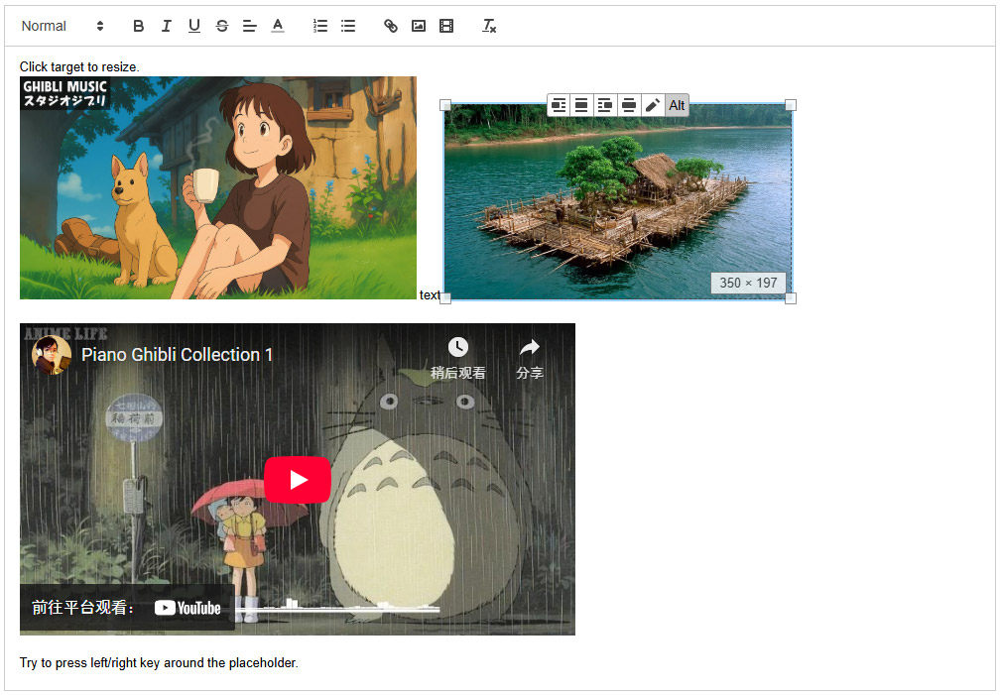

# Quill Resize Module

A module for Quill rich text editor to allow images/iframe/video and custom elements to be resized.

This module is original forked from <https://github.com/whatcould/quill-image-resize-module>.

## Changed V2
1. Support Quill2
2. Removed formats/image formats/placeholder
3. Removed `options.styles`
4. Add `embedTags` option for custom embed element
4. Add `tools` option for custom toolbar

## Features
 - Image resize
 - Embed resize (Default to iframe/video tag)
 - Custom any elements resize

 - Limit minWidth/maxWidth/minHeight/maxHeight
 - Limit Width/Height ratio
 - Selected embed element style
 - Direction key support

## Demo

<https://codesandbox.io/p/sandbox/9m9vl8>


## Usage

### Webpack/ES6

```javascript
import Quill from 'quill';
import QuillResize from 'quill-resize-module';
Quill.register('modules/resize', QuillResize);

const quill = new Quill(editor, {
    // ...
    modules: {
        // ...
        resize: {
            // See optional "config" below
        }
    }
});
```

### Script Tag

Copy resize.js into your web root or include from node_modules

```html
<script src="/node_modules/quill-resize-module/dist/resize.js"></script>
```

```javascript
var quill = new Quill(editor, {
    // ...
    modules: {
        // ...
        resize: {
            // See optional "config" below
        }
    }
});
```

### Config

Here's a complete configuration example showing all available options:

```javascript
const quill = new Quill(editor, {
    modules: {
        resize: {
            // Enable feature modules
            modules: ['DisplaySize', 'Toolbar', 'Resize', 'Keyboard'],

            // Enable keyboard arrow keys for selection
            keyboardSelect: true,

            // CSS classes for selected and active states
            selectedClass: 'selected',
            activeClass: 'active',

            // Resizable embedded tags (video and iframe by default)
            embedTags: ['VIDEO', 'IFRAME'],

            // Toolbar buttons (default: left align, center, right align, full width, edit)
            tools: ['left', 'center', 'right', 'full', 'edit'],

            // Parchment configuration: set attributes and limits for different element types
            parchment: {
                // Image configuration
                image: {
                    attribute: ['width'],  // Adjustable attributes
                    limit: {
                        minWidth: 100      // Minimum width limit
                    }
                },
                // Video configuration
                video: {
                    attribute: ['width', 'height'],  // Adjustable attributes
                    limit: {
                        minWidth: 200,     // Minimum width limit
                        ratio: 0.5625      // Width/height ratio limit (16:9)
                    }
                }
            },

            // Event callbacks
            onActive: function (blot, target) {
                // Triggered when an element is activated
            },

            onInactive: function (blot, target) {
                // Triggered when an element is deactivated
            },

            onChangeSize: function (blot, target, size) {
                // Triggered when element size changes
            }
        }
    }
});
```

You can use only specific modules based on your needs. For example, if you only want resize and size display functionality:

```javascript
const quill = new Quill(editor, {
    modules: {
        resize: {
            modules: ['Resize', 'DisplaySize']
        }
    }
});
```

### Module Details

#### `Resize` Module - Element Resizing

This module adds drag handles to elements, allowing size adjustment via mouse. The behavior is controlled through the `parchment` configuration for different element types:

```javascript
const quill = new Quill(editor, {
    modules: {
        resize: {
            parchment: {
                // Image element configuration
                image: {
                    // Adjustable attributes: ['width'] or ['width', 'height']
                    attribute: ['width'],
                    // Size limits
                    limit: {
                        minWidth: 200,     // Minimum width
                        maxWidth: 600,     // Maximum width
                        minHeight: 200,    // Minimum height
                        maxHeight: 450,    // Maximum height
                        ratio: 0.5625      // Width/height ratio (e.g., 16:9 = 0.5625)
                    }
                },
                // Similar configuration can be added for other element types
                video: {
                    // ...
                }
            }
        }
    }
});
```

#### `Toolbar` Module - Toolbar

The toolbar module provides quick action buttons that can be customized through the `tools` option:

1. Predefined buttons:
- `left`: Left align
- `center`: Center align
- `right`: Right align
- `full`: Full width
- `edit`: Edit button

2. Custom button example:

```javascript
const quill = new Quill(editor, {
    modules: {
        resize: {
            tools: [
                'left', 'right',  // Use predefined buttons
                {
                    text: 'Alt',  // Button text
                    // Custom button attributes
                    attrs: {
                        title: 'Set image alt',
                        class: 'btn-alt'
                    },
                    // Button display condition
                    verify (activeEle) {
                        return activeEle?.tagName === 'IMG';
                    },
                    // Button click handler
                    handler (evt, button, activeEle) {
                        let alt = activeEle.alt || '';
                        alt = window.prompt('Alt for image', alt);
                        if (alt != null) {
                            activeEle.setAttribute('alt', alt);
                        }
                    }
                }
            ]
        }
    }
});
```

#### `DisplaySize` Module - Size Display

Shows current size information while resizing elements. No additional configuration needed. Included in the default module list:

```javascript
const quill = new Quill(editor, {
    modules: {
        resize: {
            modules: ['Resize', 'DisplaySize']
        }
    }
});
```

#### `Keyboard` Module - Keyboard Support

Enables element selection and manipulation using keyboard arrow keys. Can be controlled using the `keyboardSelect` option:

```javascript
const quill = new Quill(editor, {
    modules: {
        resize: {
            keyboardSelect: true  // Enable keyboard arrow key selection
        }
    }
});
```

#### Custom Module Development

You can create your own module by extending the `BaseModule` class. Here's a complete example:

```javascript
import QuillResize from 'quill-resize-module';
Quill.register('modules/resize', QuillResize);

class MyModule extends QuillResize.Modules.Base {
    // See src/modules/BaseModule.js for documentation on the various lifecycle callbacks
}

const quill = new Quill(editor, {
    modules: {
        // Other modules...
        resize: {
            modules: [MyModule, QuillResize.Modules.Resize],
            // Other configuration...
        }
    }
});
```
